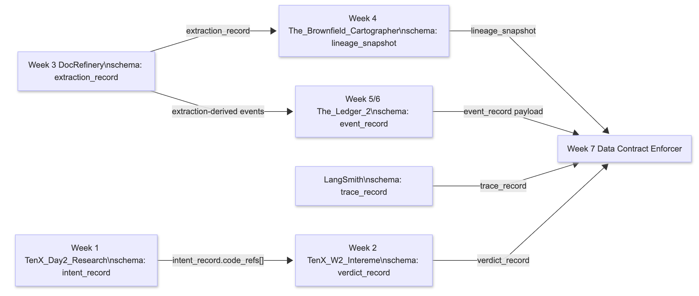
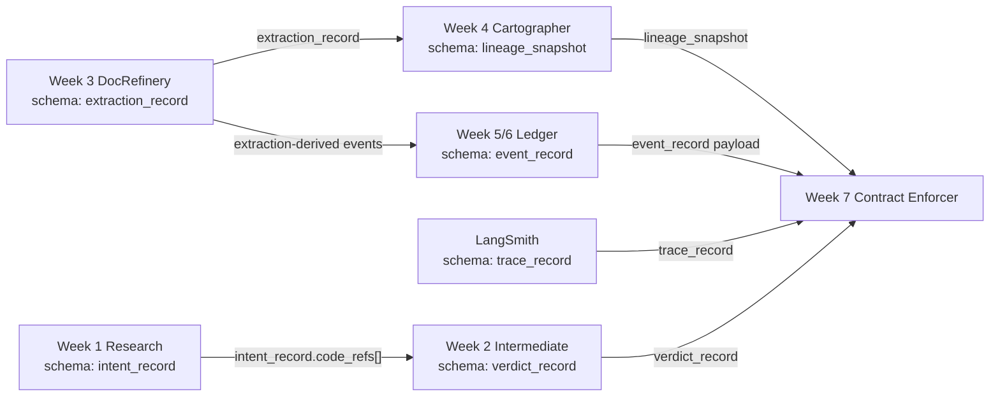

# Final Report: Data Contract Enforcer

## Executive Summary

This report summarizes the Week 7 Data Contract Enforcer using the live artifacts generated from this repository. The core enforcement pattern is producer-published contracts plus consumer-side validation at ingestion time. The strongest demonstrated failure is a Week 3 confidence scale break: `extracted_facts.confidence` shifted from the promised `0.0-1.0` range to `0-100`, which was caught by both a structural contract clause and a statistical drift check before downstream consumers could trust the data.

The report below is grounded in these machine-generated files:

- `enforcer_report/report_data.json`
- `validation_reports/violated_run.json`
- `violation_log/demo_blame_chain.json`
- `validation_reports/schema_evolution.json`
- `validation_reports/ai_extensions.json`

## Data Flow Architecture

The enforcer protects the highest-risk interfaces across the earlier weeks:

- **Week 1**: [TenX_Day2_Research](https://github.com/Gersum/TenX_Day2_Research.git)
- **Week 2**: [TenX_W2_Intereme](https://github.com/Gersum/TenX_W2_Intereme.git)
- **Week 3**: [DocRefinery](https://github.com/Gersum/DocRefinery.git)
- **Week 4**: [The_Brownfield_Cartographer](https://github.com/Gersum/The_Brownfield_Cartographer.git)
- **Week 5 and Week 6**: [The_Ledger_2](https://github.com/Gersum/The_Ledger_2.git)




## Contract Coverage Table

| Interface | Schema | Contract Written? | Notes |
|---|---|---|---|
| Week 3 DocRefinery -> Week 7 | `extraction_record` | Yes | `generated_contracts/week3_extractions.yaml` protects confidence range, entity validity, timestamps, IDs, and drift-sensitive fields. |
| Week 5/6 Ledger -> Week 7 | `event_record` | Yes | `generated_contracts/week5_events.yaml` protects event timestamps, schema version, payload shape, and ordering logic. |
| Week 1 -> Week 2 | `intent_record.code_refs[]` | Partial | Documented in `DOMAIN_NOTES.md`, but not yet enforced by its own YAML contract. |
| Week 3 -> Week 4 | `extraction_record` | Partial | Covered indirectly through the Week 3 contract plus registry and lineage attribution. |
| LangSmith -> Week 7 | `trace_record` | Partial | Used in the platform model and README, but not yet emitted as a standalone generated contract. |
| Week 2 -> Week 7 | `verdict_record` | Partial | Consumed by AI checks; still missing a standalone YAML contract. |

## 1. Validation Run Results

The clearest validation evidence comes from the violated Week 3 run in `validation_reports/violated_run.json`. This run was executed in `ENFORCE` mode against `outputs/week3/extractions_violated.jsonl`, so the pipeline action is `BLOCK`.

### Run Summary

- Records validated: `51`
- Total clause-level checks: `20`
- PASS: `15`
- FAIL: `5`
- WARN: `0`
- ERROR: `0`

### Failing Checks

1. `week3.extracted_facts.confidence.range`
   Field: `extracted_facts.confidence`
   Severity: `CRITICAL`
   Expected: `0.0 <= confidence <= 1.0`
   Actual: `minimum 0.76`, `maximum 76.0`
   Records failing: `5`
   Why it matters: Week 4 Cartographer uses this field for node ranking and trust weighting. A scale change silently turns weak signals into strong ones.

2. `week3.entities.type.enum`
   Field: `entities.type`
   Severity: `HIGH`
   Expected: one of the accepted entity enum values
   Actual sample: `"TEAM"`
   Records failing: `1`
   Why it matters: downstream consumers relying on stable entity categories would mis-bucket or reject the record.

3. `week3.extracted_facts.entity_refs.valid`
   Field: `extracted_facts.entity_refs_valid`
   Severity: `CRITICAL`
   Expected: every referenced entity ID resolves inside the same extraction payload
   Actual: boolean truth check failed
   Records failing: `1`
   Why it matters: Week 4 graph construction can ingest structurally valid UUIDs that still point to missing entities, producing broken edges.

4. `drift.extracted_facts.confidence`
   Field: `extracted_facts.confidence`
   Severity: `MEDIUM`
   Expected baseline mean: `0.76`
   Actual mean: `8.136470588235294`
   Why it matters: this is the statistical companion to the structural range failure. It confirms the semantic scale shift at the distribution level.

5. `drift.extracted_facts.entity_ref_count`
   Field: `extracted_facts.entity_ref_count`
   Severity: `MEDIUM`
   Expected baseline mean: `2.0`
   Actual mean: `2.019607843137255`
   Why it matters: a small structural corruption in entity references was enough to move the semantic baseline.

This combination of structural and statistical failures gives a clear picture: the data is not just malformed in one field; the violated extraction payload would actively mislead downstream systems if it were allowed through.

## 2. Enforcer Report (Auto-Generated)

The machine-generated report lives in `enforcer_report/report_data.json` and is built from live `validation_reports/*.json` and `violation_log/violations.jsonl` data via `contracts/report_generator.py`.

### Health Score

- **Data Health Score:** `47 / 100`
- **Formula:** `(checks_passed / total_checks) * 100 - (critical_violations * 20)`
- **Checks passed:** `62`
- **Total checks:** `71`
- **Pass-rate component:** `87.32`
- **Critical violations:** `2`
- **Critical penalty:** `40`
- **Final score:** `47`

### Violations by Severity

- `CRITICAL`: `2`
- `HIGH`: `4`
- `MEDIUM`: `3`
- `LOW`: `0`

### Schema Changes Detected

- `extracted_facts.confidence`
  Change type: `SEMANTIC_RANGE_SHIFT`
  Compatibility: `BREAKING`
  Impact: confidence max moved from `0.76` to `76.0`, indicating a `0.0-1.0 -> 0-100` scale break.

### AI System Risk Assessment

- `embedding_drift`: `PASS`, drift score `0.0`, threshold `0.15`
- `prompt_input_schema`: `PASS`, `51` valid, `0` quarantined
- `output_violation_rate`: `PASS`, violation rate `0.0`, baseline `0.0`, trend `stable`

### Prioritized Recommended Actions

1. Update `src/extractor.py` so `extracted_facts.confidence` continues to satisfy clause `week3.extracted_facts.confidence.range` with values in the `0.0-1.0` range, and keep `contracts/runner.py` in CI to block future scale drift.
2. Update `src/extractor.py` so `extracted_facts.entity_refs` only reference emitted entity IDs and satisfy clause `week3.extracted_facts.entity_refs.valid` before Week 3 records are published.
3. Normalize `occurred_at`, `recorded_at`, and `schema_version` in `outputs/migrate/create_week5_direct_import.py` and `src/events.py` so clauses `week5.occurred_at.datetime`, `week5.recorded_at.datetime`, and `week5.schema_version.enum` pass before ingestion.

These are actionable because each one names the producer file, the failing field, and the contract clause the producer must satisfy.

## 3. Violation Deep-Dive: Blame Chain and Blast Radius

The deepest analysis centers on `week3.extracted_facts.confidence.range`.

### Failing Check

- Failing clause: `week3.extracted_facts.confidence.range`
- Field: `extracted_facts.confidence`
- Severity: `CRITICAL`
- Failure: contract expected values between `0.0` and `1.0`; observed maximum was `76.0`

### Lineage Traversal

The attributor traces the failure in three layers:

1. **Schema element**: `extracted_facts.confidence`
2. **Producer namespace**: `service::week3-document-refinery`
3. **Producer file candidate**: `file::src/extractor.py`

This is registry-first attribution: the registry answers who is directly affected, and the lineage graph enriches how far the contamination can travel inside visible systems.

### Ranked Blame Chain

- Rank 1: `service::week3-document-refinery` with confidence score `0.92`
- Rank 2: `file::src/extractor.py` with confidence score `0.71`
- Git commit: `b4fac6ffc27077b615086971f7b34b85b8be47fa`
- Author: `Codex Builder`

The attribution is high-confidence rather than speculative because the top-ranked candidates sit directly on the producer side of the failing field family, and both the service namespace and producer file were recovered from the lineage context.

### Blast Radius

- **Direct contract subscribers:** `week4-cartographer`
- **Subscriber count:** `1`
- **Lineage-enriched direct nodes:** `12`
- **Transitively contaminated nodes:** none beyond depth `1` in the visible graph
- **Contamination depth:** `1`

Operationally, this means the break would first distort Week 4 ranking logic and then contaminate any event publication or reporting built from those ranked outputs.

## 4. Schema Evolution Case Study

The schema analyzer compared two explicit snapshots:

- Previous: `schema_snapshots/week3_document_refinery_extractions/20260404T100655Z.json`
- Current: `schema_snapshots/week3_document_refinery_extractions/20260404T100745Z.json`

### Human-Readable Diff

```diff
- extracted_facts.confidence maximum: 0.76
+ extracted_facts.confidence maximum: 76.0
```

### Taxonomy Classification

- Change type: `SEMANTIC_RANGE_SHIFT`
- Compatibility verdict: `BREAKING`
- Interpretation: this is not just a wider numeric range; it is a change in the meaning of the field from normalized probability-like confidence to percentage-like confidence.

This is the kind of change a production tool such as Confluent Schema Registry would typically block at registration time under a strict compatibility mode. In this project, `contracts/schema_analyzer.py` catches it from snapshots after generation.

### Migration Impact

Before the producer ships this change, downstream teams must:

1. Keep Week 3 consumers on the `0.0-1.0` contract or explicitly migrate their threshold logic if a percentage scale is ever introduced.
2. Backfill bad records before rerunning lineage generation and event publication jobs.
3. Add pre-merge validation on extraction payloads so this scale break is stopped before it becomes consumer-visible.

### Rollback Plan

1. Restore the last known-good extractor release.
2. Re-run contract validation on the clean extraction dataset.
3. Replay only validated events into the Week 5 event store.
4. Re-establish the affected statistical baselines, especially `extracted_facts.confidence` and `extracted_facts.entity_ref_count`, before treating future drift checks as trusted again.

## 5. AI Contract Extension Results

The AI contract extensions were run against real Week 3 extraction text and real Week 2 verdict records.

### Embedding Drift

- Method: cosine-distance drift check
- Drift score: `0.0`
- Threshold: `0.15`
- Verdict: `PASS`

Interpretation: the semantic center of the Week 3 text remained stable relative to the stored baseline.

### Prompt Input Validation

- Valid inputs: `51`
- Quarantined inputs: `0`
- Verdict: `PASS`

Interpretation: prompt payloads are structurally trustworthy enough to reach the model layer without needing quarantine.

### LLM Output Schema Violation Rate

- Total outputs: `4`
- Schema violations: `0`
- Violation rate: `0.0`
- Baseline rate: `0.0`
- Trend: `stable`
- Verdict: `PASS`

Interpretation: there is no current evidence of schema drift in the Week 2 verdict outputs. If this rate rises without a prompt change, the most likely explanation would be an upstream model behavior shift rather than a prompt-shape regression.

Overall conclusion: the AI-specific signals are currently trustworthy. The platform is seeing real contract failures in upstream structured data, not broad AI instability.

## 6. Highest-Risk Interface Analysis

### Interface Identification

The highest-risk interface is the transfer of the Week 3 `extraction_record` schema from **DocRefinery** into **Week 4 Cartographer**, especially the nested fields `extracted_facts.confidence` and `extracted_facts.entity_refs`.

### Failure Mode

The most dangerous realistic failure is a **semantic dangling reference**: a record whose `entity_refs` values are valid UUID strings but no longer correspond to an entity in the same payload.

- Class: primarily **structural-semantic**
- Why it is dangerous: the payload still looks syntactically correct, so a shallow type or UUID validator would accept it while graph construction quietly builds broken edges.

### Enforcement Gap

Checks that would catch it:

- `week3.extracted_facts.entity_refs.valid`
- `week3.entities.type.enum` when the corruption changes semantic categories
- drift checks if the bug becomes common enough to move distributions

Checks that would miss it:

- required-field checks
- UUID-format checks
- simple type checks
- most statistical checks when only one or two records are affected

So the gap is not “we lack validation.” The gap is that weak enforcement modes or shallow structural checks alone are not enough for this interface.

### Concrete Recommendation

Upgrade the Week 3 -> Week 4 consumer boundary to `ENFORCE` mode for clause `week3.extracted_facts.entity_refs.valid`, and add a companion contract clause requiring every referenced entity ID to appear in `entities.entity_id` within the same extraction payload. That change would materially reduce the probability of silent graph corruption in production.
