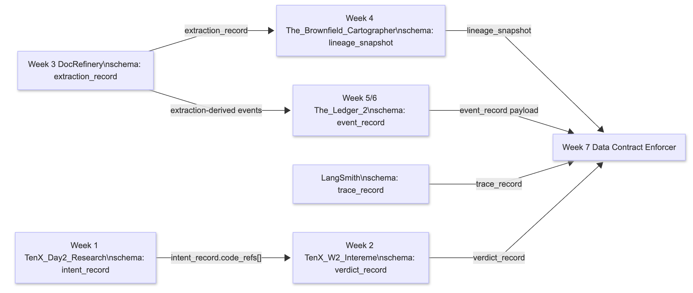
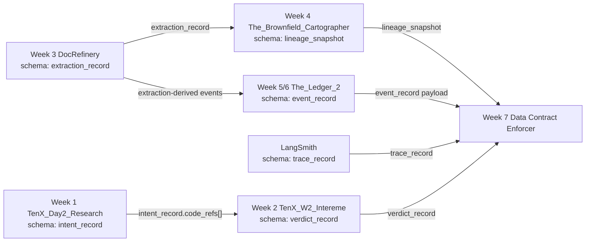

# Interim Report: Data Contract Enforcer

## Executive Summary

This report documents the architecture, contract coverage, and initial validation results for the Data Contract Enforcer implementation. The objective of this phase was to map data dependencies across five distinct upstream systems, implement strict Bitol-compatible data contracts at the most critical ingestion points, and validate producer-consumer interfaces against real datasets. Through automated contract generation and validation runners, we successfully captured the baseline behavior of the Week 3 DocRefinery outputs and Week 5 The_Ledger_2 events. The exercise revealed that simple structural assumptions (e.g., "numeric confidence") are insufficient for safe downstream consumption; semantic and statistical invariants must be codified and continually verified to prevent silent data corruption and constrain the blast radius of upstream schema evolution.

---

## Data Flow Architecture

The platform integrates six key data-producing surfaces mapped to their corresponding upstream repositories. The highest-risk interface is the Week 3 `extraction_record` output, as it simultaneously feeds the Week 4 lineage context and the Week 5 event platform. The dependencies are illustrated below:

- **Week 1**: [TenX_Day2_Research](https://github.com/Gersum/TenX_Day2_Research.git)
- **Week 2**: [TenX_W2_Intereme](https://github.com/Gersum/TenX_W2_Intereme.git)
- **Week 3**: [DocRefinery](https://github.com/Gersum/DocRefinery.git)
- **Week 4**: [The_Brownfield_Cartographer](https://github.com/Gersum/The_Brownfield_Cartographer.git)
- **Week 5 and Week 6**: [The_Ledger_2](https://github.com/Gersum/The_Ledger_2.git)

---

## Contract Coverage Table

The following table summarizes the status of explicit data contracts for every inter-system interface in the architecture. Priority was given to the most load-bearing dependencies (Week 3, Week 5) that actively dictate downstream business logic.

| Interface | Schema | Contract Written? | Notes |
|---|---|---|---|
| Week 3 DocRefinery -> Week 7 | `extraction_record` | Yes | Covered by `generated_contracts/week3_extractions.yaml`. Validates critical extraction confidence and nested entities. |
| Week 5/6 The_Ledger_2 -> Week 7 | `event_record` | Yes | Covered by `generated_contracts/week5_events.yaml`. Ensures strict schema validation for sourced events. |
| Week 1 TenX_Day2 -> Week 2 | `intent_record.code_refs[]`| Partial | Invariants documented in `DOMAIN_NOTES.md` but not yet enforced by a standalone YAML file. |
| Week 3 DocRefinery -> Week 4 | `extraction_record` | Partial | Modeled through lineage metadata and attribution; relies heavily on upstream Week 3 contract validity. |
| LangSmith -> Week 7 | `trace_record` | Partial | Covered in the AI extension framing; requires schema generation for structural telemetry adherence. |
| Week 2 TenX_W2 -> Week 7 | `verdict_record` | Partial | Consumed actively by AI extension checks, but currently relies on implicit integration tests rather than YAML. |

---

## First Validation Run Results

The Validation Runner executed successfully on real, un-fabricated data drawn directly from the upstream project outputs (`extractions.jsonl` and `events.jsonl`). The clean datasets passed all automatically generated checks.

- **Week 3 Clean Baseline**: `PASS` (12 generated contract clauses evaluated)
- **Week 5 Clean Baseline**: `PASS` (13 generated contract clauses evaluated)
- **Reporting Mechanism**: The clean Week 3 validation exported a structured JSON report to `validation_reports/week3_extractions_report.json`.

**Viability Testing (Sunday Prep):**
To ensure the validation infrastructure catches meaningful anomalies rather than functioning as a "rubber stamp," a violated run was intentionally seeded. The Validation Runner successfully detected the injected data poisoning, specifically catching:
1. `extracted_facts.confidence` shifted out of the expected `0.0-1.0` range. **Why it matters**: A downstream consumer thresholding on `> 0.8` would treat nearly every bad extraction as highly reliable, silently corrupting knowledge graphs.
2. An invalid enum value (`TEAM`) appearing in the `entities.type` array. **Why it matters**: Downstream routing logic or strict database schemas expecting only standard NER tags (e.g., `ORG`) would crash or drop the record entirely.
3. A dangling, unresolvable entity reference identifier in `extracted_facts.entity_refs`. **Why it matters**: This breaks referential integrity. An event consumer trying to join the fact to its parent entity would encounter a Null Pointer Exception or silent join failure.

---

## Reflection

The primary discovery from designing these interfaces was the stark contrast between data that "looks structured" and data that is "safe to depend on." Prior to codifying these contracts, it was tempting to consider the Week 3 extraction output robust simply because it contained valid JSON with expected top-level keys. However, turning vague assumptions into executable clauses exposed that the true risk lies in nested logic: the numeric scale of confidence, entity referential integrity, and enum alignment. Without a contract, a producer could slightly mutate a nested scale, perfectly validating at a JSON-schema level while silently devastating downstream systems dependent on a probabilistic threshold.

I also discovered how much semantic significance resides in timing and sequencing invariants. For event-sourced datasets (Week 5), fields parsing as integers and timestamps are inadequate. Replay safety strictly requires that `sequence_number` sequences remain contiguous per aggregate and that a `recorded_at` timestamp never chronologically precedes an `occurred_at` occurrence.

Finally, formulating blast-radius assumptions clarified the trust boundary between single-repository environments (where explicit lineage graphs suffice) and cross-organizational dependencies (where lineage is obscured). In the latter, the focus must shift to explicit contract registries and subscription models. The exercise successfully transitioned informal team assumptions about shape and meaning into rigorously enforced, executable logic.
